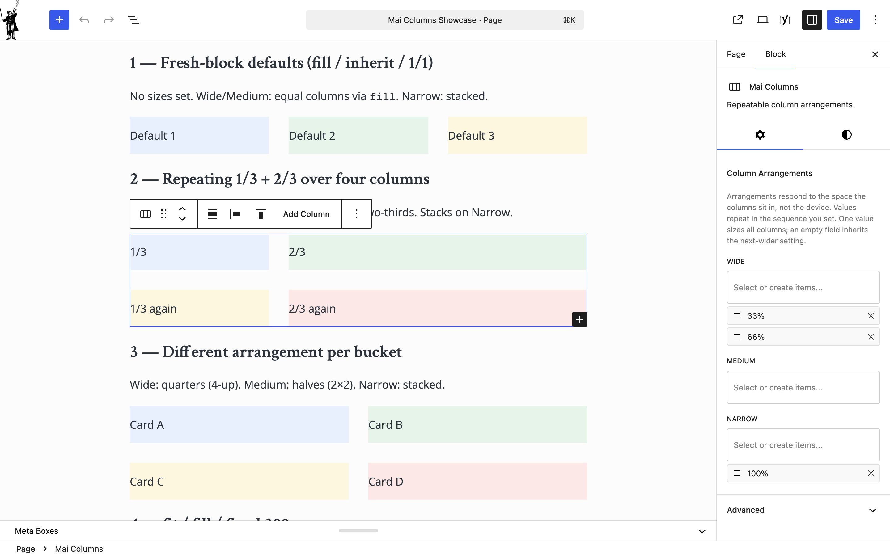
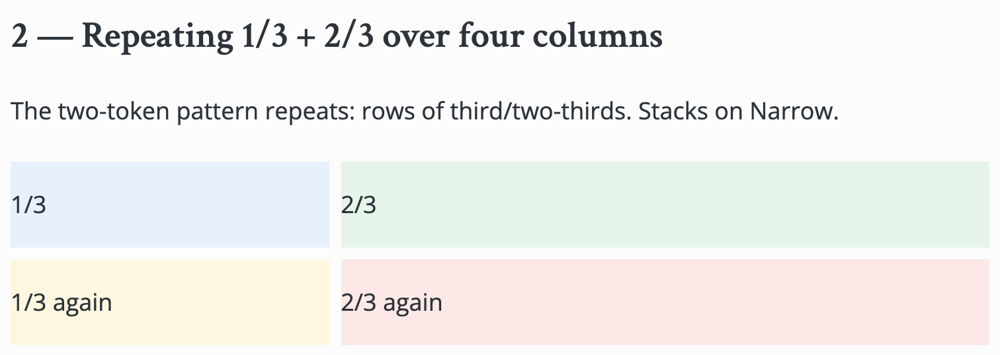
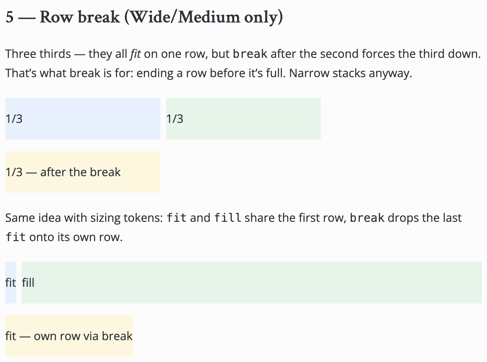
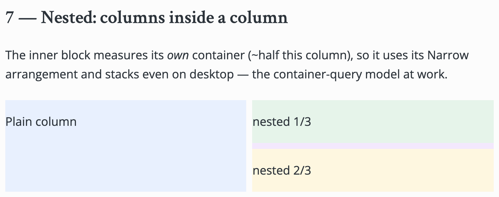

# Mai Columns
Repeatable, per-width column arrangements with simple and complex layouts.

Define an arrangement — a sequence of size tokens that repeats across however many columns you add — per width bucket: Wide (≥1024px), Medium (640–1023px), Narrow (<640px). Buckets measure the **container** the columns sit in (CSS container queries), not the device, so nested columns and sidebar placements respond to their own available room.

## Tokens
Preset fractions (`25%`–`100%`), custom fractions (`2/5`), percentages, CSS lengths (`300px`), `fit` (hug content), `fill` (share leftover space), and `break` (end the row early). Empty buckets inherit the next-wider setting.

## Ordering
Per-bucket "Reverse" toggles on the parent block, plus an optional per-column order value per bucket (CSS `order` — visual only; keyboard and screen reader order follows the document).

## Requirements
WordPress 7.0+, PHP 8.2+. Works with any theme.

## Development
- `npm install && npm run build` — build the blocks (build output is committed).
- `php tests/harness/arrangement-resolver.php` — PHP resolver tests.
- `node --test tests/js/` — JS resolver tests (same shared fixtures, so editor preview and PHP render can't drift).
- `tests/e2e/` — Playwright front-end matrix + a reusable showcase page (`wp post create tests/e2e/showcase-page.html --post_type=page --post_status=publish --post_title='Mai Columns Showcase' --post_name=mai-columns`).
